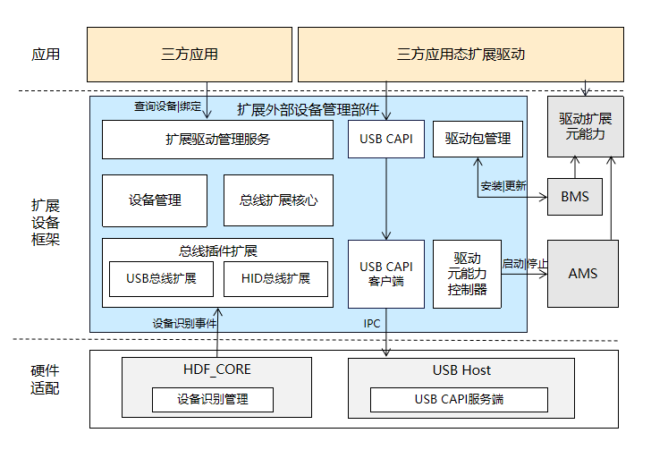

# 扩展外部设备管理

## 简介

该仓主要存放OpenHarmony驱动子系统扩展外部设备管理框架核心源码信息（包括扩展驱动管理服务、扩展设备管理、扩展驱动包信息管理、扩展驱动能力控制器、总线扩展核心、总线扩展插件），承载扩展驱动包全流程生命周期管理，旨在为开发者提供更高效、安全、且低成本的扩展外部设备驱动开发解决方案，做到即插即用的用户体验。

**图 1**  扩展外部设备管理框架架构图 


扩展外部设备管理框架主要包含八部分：<br>
1、驱动扩展Ability----应用态扩展驱动能力的抽象，是应用Stage模型ExtensionAbility类中的一种，提供驱动硬件访问能力。<br>
2、扩展驱动管理服务----支持扩展驱动管理服务按需启动能力，负责设备管理，包信息管理，总线扩展核心模块生命周期管理。<br>
3、扩展设备管理----提供扩展设备查询和绑定能力，负责设备列表管理，设备与驱动匹配管理。<br>
4、扩展驱动包信息管理----负责扩展驱动包信息解析，存储，设备匹配，支持扩展驱动包的安装，更新，卸载能力。<br>
5、扩展驱动Ability控制器----负责扩展驱动Ability生命周期管控，包括扩展驱动Ability的启动，停止。<br>
6、总线扩展核心----负责总线设备枚举、总线驱动包解析、包与设备匹配能力。<br>
7、USB总线扩展插件----负责USB设备热插拔监听，USB设备信息读取。<br>
8、USB C API----提供USB设备对三方应用提供的硬件访问接口。<br>

## 目录

```
/drivers/external_device_manager
├── frameworks # 无独立进程的桥接实现
│   └── js # 对外提供应该js API需要
│       └──-napi # napi代码实现
│           ├── driver_ext_ability # ext ability桥接类
│           ├── driver_ext_context # ext context桥接类
│           └── driver_ext_manager # device ext manager桥接类
├── interfaces # 对外提供.d.ts接口定义和capi实现
│   ├── innerkits # 部件接口，系统内部件间接口
│   └── kits # 提供应用的接口
│       └── js # js接口
├── sa_profile # SA定义
├── services # 扩展设备管理系统服务实现
│   ├── native
│   │   ├── driver_extension # driver extension ability 和driver extension context定义和实现
│   │   │   ├── include # driver extension接口定义 
│   │   │   └── src # driver extension接口实现
│   │   └── driver_extension_manager #各子模块实现
│   │       ├── include
│   │       │   ├── bus_extension # 总线管理接口定义
│   │       │   ├── device_manager # 设备管理接口定义
│   │       │   ├── driver_ability_controller # ability生命周期管理接口定义
│   │       │   └── driver_pkg_manager # 包管理接口定义
│   │       └── src
│   │           ├── bus_extension # 总线管理接口实现
│   │           ├── device_manager # 设备管理接口实现
│   │           ├── driver_ability_controller # ability生命周期管理接口实现
│   │           └── driver_pkg_manager# 包管理接口实现
│   └── zidl # js跨进程实现
│       ├── include# js跨进程接口定义
│       └── src # js跨进程接口实现
└── utils # 通用接口实现和 hilog封装
    └── include # 通用接口定义
```

## 场景说明

扩展外部设备管理框架支持三方设备厂商开发非标准协议的USB可插拔设备驱动接入OpenHarmony系统，提供应用直接访问非标准协议的可插拔设备硬件能力。设备厂商开发者只需以HAP包形式开发和发布扩展驱动包，并通过OpenHarmony系统安全认证后，对其他三方HAP和系统服务提供硬件接访问能力，实现非标准协议的可插拔设备快速接入。

## 编译构建

编译32位ARM系统external_device_manager部件
```
./build.sh --product-name {product_name} --ccache --build-target external_device_manager
```

编译64位ARM系统external_device_manager部件
```
./build.sh --product-name {product_name} --ccache --target-cpu arm64 --build-target external_device_manager
```

{product_name}为当前支持的平台，比如rk3568。

## 相关仓

[驱动子系统](https://gitee.com/openharmony/docs/blob/master/zh-cn/readme/%E9%A9%B1%E5%8A%A8%E5%AD%90%E7%B3%BB%E7%BB%9F.md)

[drivers\_hdf\_core](https://gitee.com/openharmony/drivers_hdf_core/blob/master/README_zh.md)

[drivers\_interface](https://gitee.com/openharmony/drivers_interface/blob/master/README_ZH.md)

[drivers\_peripheral](https://gitee.com/openharmony/drivers_peripheral/blob/master/README_zh.md)
